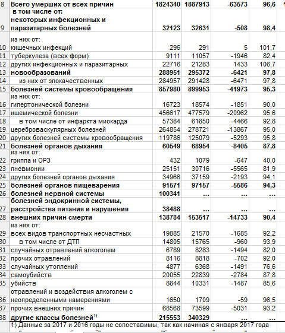

В прошлый раз мы смотрели, что происходит в России с пропавшими без вести: становится ли их больше, и в каких регионах люди теряются чаще всего. В этом документе мы обратимся к статистике Министерства здравоохранения о причинах смертности россиян в 2017 году.  
Мы хотим ответить на вопос, из-за чего чаще всего умирают люди в России. Для этого мы обратимся вот к [этому](http://www.gks.ru/free_doc/2017/demo/t3_3.xls) xls-файлу, скачаем его, приведём в порядок и проанализируем: сначала построим табличку, а потом - красивый график в пакете ggplot2.

# Шаг 1. Скачиваем и открываем данные

Часто перед самой работой с данными их нужно загрузить. Иногда для этого используется [веб-парсинг](http://alexeyknorre.ru/other/wsinr/), если данные расположены внутри веб-страницы, а иногда файлы можно скачать напрямую. Для этого есть функция `download.file()`. В качестве первого аргумента мы подаём URL-адрес файла, а в качестве второго -- путь и название файла. Помните, что `url =` и `destfile =` можно удалить - R поймёт, что это первый и второй аргументы соответственно.

! Обратите внимание: обязательно нужно добавлять аргумент `mode = "wb"` при работе в Windows, иначе при загрузке файл повреждается (не знаю, почему, мне даже [пришлось спросить](https://github.com/tidyverse/readxl/issues/439))

```{r}
download.file(url = "http://www.gks.ru/free_doc/2017/demo/t3_3.xls",
              destfile = "data/deaths-in-russia-2017.xls", mode = "wb")
```

Файл скачался. Однако он в проприетарном Экселевском формате. К счастью, добрые и самоотверженные люди из экосистемы R (а точнее Дженнифер Брайан {кстати, [тут](https://ropensci.org/blog/2017/12/08/rprofile-jenny-bryan/) можно почитать её клёвое автобиографическое интервью про переход из академии в компанию-разработчик RStudio} и Хэдли "Его высокоаршейство" Уикхэм) написали отличный пакет, который умеет импортировать данные в форматах xls и xlsx в R; пакет называется `readxl` и он мощно и быстро переваривает Эксель (когда-то для этого нужно было использовать тяжелый `openxlsx`, а до этого -- жуткий и подвязанный на Java `xlsx`).  

Не забываем установить:
```{r eval=F}
install.packages("readxl")
```

и подгружаем библиотеку:

```{r warning=FALSE}
library(readxl)
```

Для считывания можно использовать функцию общего назначения `read_excel()`, которая автоматически определяет по расширению файла, какой формат мы используем (более новый xlsx отличается от xls, тем, что на самом деле является архивом). Синтаксис такой:
```{r}
read_excel
```

- `path` - путь к файлу, главный и единственный необходимый аргумент. Все остальные опциональные.
- `sheet` - обозначает, к какому листу внутри файла Excel вы хотите обратиться (можно написать номер, можно название листа, а можно ничего не писать - прочтётся самый первый).
- `range` - позволяет заранее сказать, какую область листа вы хотите прочесть, если заранее знаете, например, что первые три строки и столбца не нужны. Можно задать этот аргумент так: `range = "C3:AP9999"`.
- `col_names` - нужно ли первую строчку воспринимать как названия переменных (по умолчанию - да).
- `col_types` - продвинутая штука, позволяющая заранее сказать, как поступать с колонками и в каком формате (числа, строки, даты) их считывать.
- `na` - позволяет сказать, какие значения в ячейках считать пропущенными значениями.
- `skip` - позволяет пропустить первые n строк при прочтении листа
- `n_max` - максимальное количество строк для прочтения (помогает отлаживать код, если файл очень большой).

Давайте уже импортируем наши данные о причинах смертности, причём так, чтобы первая строка не становилась заголовком.

```{r}
df <- read_xls("data/deaths-in-russia-2017.xls", col_names = F)
df
```

# Шаг 2. Чистим данные

Выглядит грязно. Кроме того, из-за импорт мы потеряли много важной информации, которую до нас в кривой форме хотели донести составители:  

  

В обычном Экселе мы видим, что жирным цветом выделены категории, а не выделенные (и отделенныё словосочетанием "из них") - это подкатегории. Это необходимо помнить при чистке данных.  
  
Как же нам раскидать категории? Я бы делал так: крупные категории разделить на подкатегории, а мелкие категории оставить как есть. В данном случае точно нужно дробить категорию болезней системы кровообращения.  
  
Кроме того, сами данные должны стать чистыми -- то есть в данном случае не должно быть подкатегорий, которые являются частью категории - иначе наблюдения перестают быть уникальными и независимыми. Давайте попробуем это сделать.  

Поскольку мы при импорте данных задали, что первая строка заголовком не является, можно опираться на картинку-скриншот и понять, какие строки нам нужно убрать или переименовать. Но сначала давайте разберёмся с переменными.  

```{r}
df
```

Нас интересует смертность в 2017 году, при этом в абсолютных показателях. Поэтому можно с чистой совестью оставить только первые две колонки:
```{r}
df <- df[,c(1,2)]
```

Теперь можно почистить категории. Убираем "всего умерших" (8 строка), строки 10-12, строку 14, крупную категорию "болезни системы кровообращения" (строка 15), строки 22-24, 28 и 30. Кроме того, последняя строка 39 - мусорная, её тоже убираем.

```{r}
df <- df[-c(8, 10:12, 14, 15, 22:24, 28, 30, 39), ] 
```


Теперь можно почистить шапку таблицы. Задаём названия переменных, убираем первые строки, немного подчищаем названия категорий и во всеуслышание объявляем, что переменная `number` - числовая. А под конец сортируем:

```{r}
names(df) <- c("cause","number")
df <- df[-c(1:7),]
df$cause <- gsub("из них от|в том числе от|1)|\\:", "", df$cause)
df$number <- as.numeric(df$number)
df <- df[order(df$number,decreasing = T),]
df
```

В принципе, уже достаточно, чтобы сделать выводы.  
Но давайте попробуем сделать из этого график.

# Шаг 3. Строим столбиковую диаграмму

```{r message=FALSE, warning=FALSE}
library(ggplot2)
```

```{r fig.height=5, fig.width=10}
p <- ggplot(data=df,
       aes(x=reorder(cause,number),y=number)) +
  geom_bar(position="dodge",stat="identity") + 
  coord_flip() +
  ggtitle("Причины смерти россиян в 2017 году.\nСмерть наступила от...") +
  xlab("") +
  ylab("Число умерших") +
  theme_minimal()

p
```


Этот график можно сохранить:

```{r}
ggsave("results/deaths-in-russia-2017.png",
       width = 10, height = 5, dpi = 400)
```

